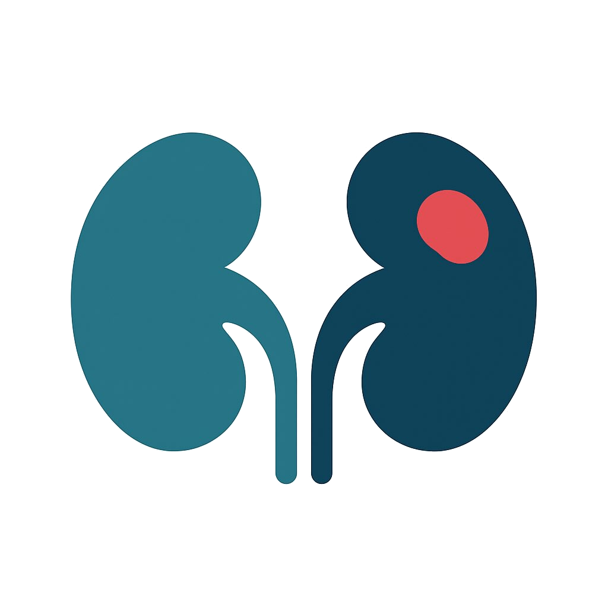

<h1 align="center">
  
  Renal-Net: Kidney Abnormality Segmentation Model
</h1>


This repository contains the code to setup the pipeline to run the Kidney Abnormality Segmentation model on CT scans. When you use this code base and the corresponding model weights, please cite our work: [kidney abnormality segmentation paper](https://doi.org/10.59275/j.melba.2026-67g5). The pipeline uses nnUNet [[1]](#1),[[2]](#2) and TotalSegmentator [[3]](#3), please also cite these works. 

## Model weights and version

The model weights can be downloaded from Zenodo: [model weights download](https://doi.org/10.5281/zenodo.15315330).

Model version: nnU-Net ResEnc L 3D fullres

Segmentation label map:
`0` — Background
`1` — Kidney
`2` — Renal mass, not further specified as cystic/solid mass

## Grand-challenge algorithm
A ready to use algorithm for research purposes is also available on grand-challenge.org: [algorithm](https://grand-challenge.org/algorithms/kidney-abnormality-segmentation/).

## Setup
The repository contains a [Dockerfile]() that can be used to create the environment. Alternatively, you can use conda or a venv with at least python 3.11 and the requirements (see [requirements](requirements.yml)).

The package can be installed from source: 

```bash
git clone https://github.com/DIAGNijmegen/oncology-kidney-abnormality-segmentation.git
cd oncology-kidney-abnormality-segmentation
pip install -e .
```

## Running the algorithm
When using the container build using the Dockerfile you can mount the input path containing the CT scans to "/input", the output path to "/output", and the folder containing downloaded model weights to "/opt/ml/model". 

When using a virtual or conda environment, you can either use the command line arguments to set the folder paths or set them as environment variables. 

### To start the script
You can kick-off the script with:

```bash
renal-net  \
-i --input-path <path> \
-m --model-path <path>\
-o --output-path (optional) <path> \
--use-cropping (optional)
```
Model path should point to the directory above `nnUNet_results`.


## Pipeline:
The algorithm does the following steps for each CT scan (in .mha / .nii.gz format) in the input folder:
1. read ct scan using SimpleITK
2. use trained nnUNet to segment the kidneys and kidney abnormalities if present
3. postprocess the kidney abnormality masks by removing small components (<3mm) and only keeping components attached to a kidney region, except when the abnormality component is larger than 100,000 mm^3.

## Cropping
You can crop to a target regions based by setting `--use-cropping`.  This uses TotalSegmentator to find bladder and lungs, and if found, crops around that in all three directions. We read TotalSegmentator weights from: `~/.totalsegmentator/nnunet/results`. If they are in a different location plase specify this environmental variable before executing the script:
```bash
export nnUNet_results='/path/to/.totalsegmentator/nnunet/results'
```
We sporadically noticed that for patients with a larger BMI, the cropping using the lungs as reference point resulted in removing parts of the kidney from the ROI. Performance gains using the cropping were minimal to begin with and therefore not using this step will not result in any performance loss.

## Issues
Please feel free to raise any issues you encounter [here](https://github.com/DIAGNijmegen/oncology-kidney-abnormality-segmentation/issues).

## References
<a id="1" href="https://www.nature.com/articles/s41592-020-01008-z">[1]</a> 
Fabian Isensee, Paul F. Jaeger, Simon A. A. Kohl, Jens Petersen and Klaus H. Maier-Hein. "nnU-Net: a self-configuring method for deep learning-based biomedical image segmentation". Nature Methods 18.2 (2021): 203-211.

<a id="2" href="https://arxiv.org/pdf/2404.09556.pdf">[2]</a>
Fabian Isensee, Tassilo Wald, Constantin Ulrich, Michael Baumgartner, Saikat Roy, Klaus H. Maier-Hein, Paul F. Jaeger. "nnU-Net Revisited: A Call for Rigorous Validation in 3D Medical Image Segmentation". Pre-print: arXiv:2404.09556v2 (2024).

<a id="3" href="https://pubs.rsna.org/doi/10.1148/ryai.230024">[3]</a>
Jakob Wasserthal, Hanns-Christian Breit, Manfred T. Meyer, Maurice Pradella, Daniel Hinck, Alexander W. Sauter, Tobias Heye, Daniel T. Boll, Joshy Cyriac, Shan Yang, Michael Bach, Martin Segeroth. "TotalSegmentator: Robust Segmentation of 104 Anatomic Structures in CT Images". Radiology: Artificial Intelligence 5:5 (2023): e230024.

## Attribution
This tool was developed by the Oncology Research Group at the Diagnostic Image Analysis Group (DIAG), Radboud University Medical Center ([visit our group page](https://diagnijmegen.nl/research/oncology)).

## Contact Information
- Sarah de Boer: Sarah.deBoer@radboudumc.nl
- Alessa Hering: Alessa.Hering@radboudumc.nl

## Citation

If you use Renal-Net for your research, please cite the [kidney abnormality segmentation paper](https://doi.org/10.59275/j.melba.2026-67g5).:

```
@article{deboer2026,
    title = "Robust Renal Mass Segmentation on CT: A Validation Study of an AI-Based Framework",
    author = "de Boer, S. and Häntze, H. and Venkadesh, K. and Buser, M.A.D. and Humpire Mamani, G.E. and Xu, L. and Adams, L.C. and Nawabi, J. and Bressem, K.K. and van Ginneken, B. and Prokop, M. and Hering, A.",
    journal = "Machine Learning for Biomedical Imaging",
    volume = "2026",
    issue = "May 2026 issue",
    year = "2026",
    pages = "229--251",
    issn = "2766-905X",
    doi = "https://doi.org/10.59275/j.melba.2026-67g5",
    url = "https://melba-journal.org/2026:012"
}
```
## Development
Install the devolopment dependencies either with `make install-dev` or `pip install -e ".[dev]"`.
Tests include fast smoke and extensive integration tests.
To run integration tests you need to create a file `integration_config.py` in the test repo. You can find a template [here](tests/integration_config.example.py).
The config file requires a path to the downloaded model weights and sample CT scans. These scans *must* depict kidney and renal masses for the tests to work. You may find some sample files [here](https://zenodo.org/records/20719257). After running the integration tests, segmentation previews are saved in a newly created `reports` directory.

```bash
make install-dev
make smoke
make full # requires model weights and sample images depicting renal masses
```
